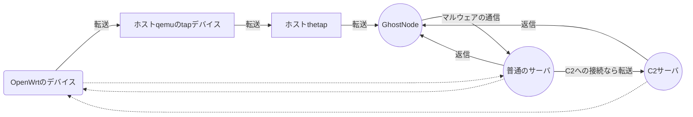

# 本研究
Used ns-3.36.1
Doesn't work below ns3.36.1  

# ns-3のインストール
endeavourosのaurを使ってインストールしました．  
エラーが出たらエラーの内容に従って各自修正してください．  
`yay -S ns3`  
参照 -> ttps://aur.archlinux.org/packages/ns3
# 本研究の実験手順
## 1. サンドボックスの起動
SandboxSh/qemu-openwrt.shを参考  
※qemu-bridge-helperを使用してください．  
参照 -> ttps://wiki.archlinux.jp/index.php/QEMU  
## 2. thetapの作成と設定
SandboxSh/ns3-tap-bridge.shを参考  
## 3. ns-3起動

## 4. サンドボックス内での操作
br-lanにIPv4追加と，デフォルトゲートの設定  
10.1.1.1/24がサンドボックス，10.1.1.3がns-3のおとりのサーバ  
 `ip addr add 10.1.1.1/24 dev br-lan`  
 `route add default gw 10.1.1.3`  

## 5. マルウェアの実行
## 6. pcapがいっぱい生成されてる
## 7. 見る
